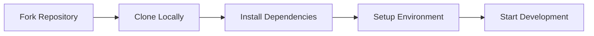
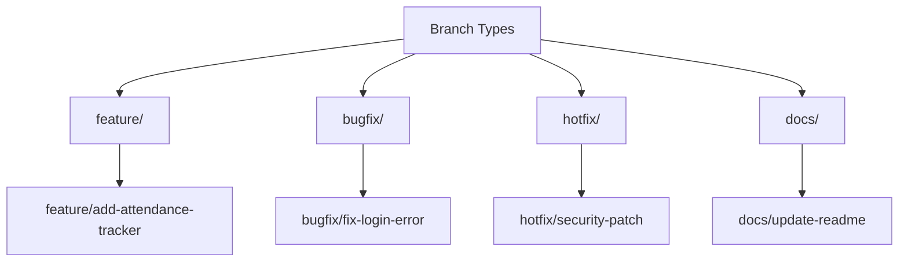
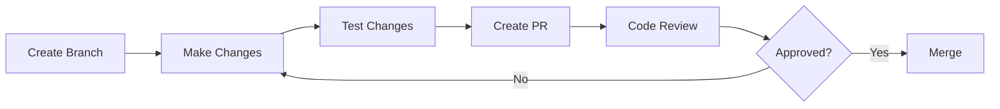
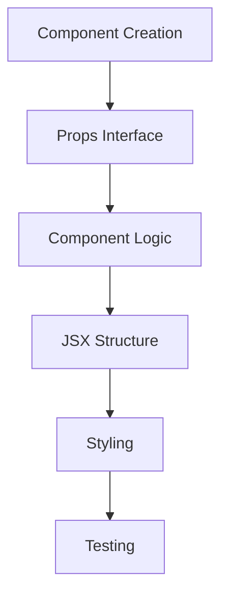
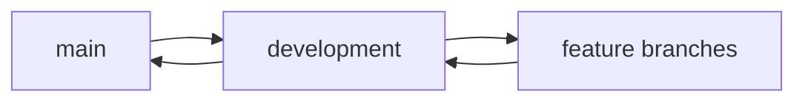

# Contributing to UniDash 🚀

First off, thank you for considering contributing to UniDash! It's people like you that make UniDash such a great tool for BITS Pilani Dubai Campus students.

## 📋 Table of Contents

- [Code of Conduct](#code-of-conduct)
- [Getting Started](#getting-started)
- [Development Workflow](#development-workflow)
- [Pull Request Process](#pull-request-process)
- [Style Guidelines](#style-guidelines)
- [Community](#community)

## 📜 Code of Conduct

This project and everyone participating in it is governed by our [Code of Conduct](CODE_OF_CONDUCT.md). By participating, you are expected to uphold this code.

## 🚀 Getting Started

### Development Environment Setup



1. **Fork the Repository**
   ```bash
   # Click the 'Fork' button on GitHub
   ```

2. **Clone Your Fork**
   ```bash
   git clone [https://github.com/your-username/unidash.git](https://github.com/HUSAM-07/AccessX.git)
   cd unidash
   ```

3. **Install Dependencies**
   ```bash
   npm install
   ```

4. **Set Up Environment Variables**
   ```bash
   cp .env.example .env.local
   # Edit .env.local with your configuration
   ```

5. **Start Development Server**
   ```bash
   npm run dev
   ```

## 💻 Development Workflow

### Branch Naming Convention




- `feature/*`: New features
- `bugfix/*`: Bug fixes
- `hotfix/*`: Critical fixes
- `docs/*`: Documentation changes

### Commit Message Format

```
<type>: <subject>
```

- **Types**: feat, fix, docs, style, refactor, test, chore
- **Scope**: component name, page name, or general area
- **Subject**: short description in present tense
- **Body**: detailed description (optional)
- **Footer**: breaking changes, issue references (optional)

## 🔄 Pull Request Process




1. **Before Creating a PR**
   - Update documentation
   - Add/update tests
   - Run linting: `npm run lint`
   - Run tests: `npm run test`

2. **PR Requirements**
   - Clear title and description
   - Reference related issues
   - Screenshots for UI changes
   - Updated documentation
   - Passing CI checks

3. **Review Process**
   - Two approvals required
   - All comments addressed
   - CI checks passing
   - No merge conflicts

## 🎨 Style Guidelines

### Code Style

- Follow TypeScript best practices
- Use ESLint and Prettier configurations
- Follow component structure:
  ```typescript
  // Component structure
  import statements
  interface definitions
  component definition
  styles (if any)
  exports
  ```

### Component Guidelines




- Use functional components with hooks
- Props interface definitions
- Meaningful component names
- Proper component organization
- Consistent styling approach

### Testing Requirements

- Unit tests for utilities
- Component tests for UI
- Integration tests for flows
- E2E tests for critical paths

## 👥 Community

### Getting Help

- Create an issue for bugs
- Discussions for questions
- Pull requests for contributions
- Email for private inquiries: f20210150@dubai.bits-pilani.ac.in

### Communication Channels

- GitHub Issues
- GitHub Discussions
- Project Discord (coming soon)

## 📝 Documentation

- Update README.md for major changes
- Document new features
- Update API documentation
- Add JSDoc comments

## 🔄 Version Control




- `main`: Production-ready code
- `development`: Integration branch
- Feature branches: Individual features

## 🚀 Release Process

1. Version bump
2. Changelog update
3. Documentation review
4. Release notes
5. Tag creation
6. Deployment

Thank you for contributing to UniDash! 🎉
