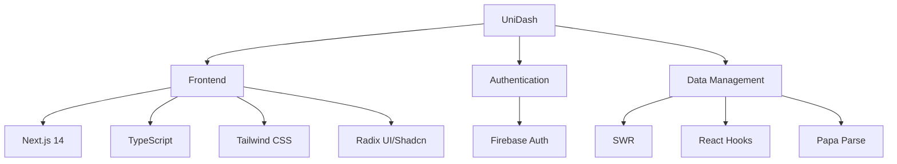
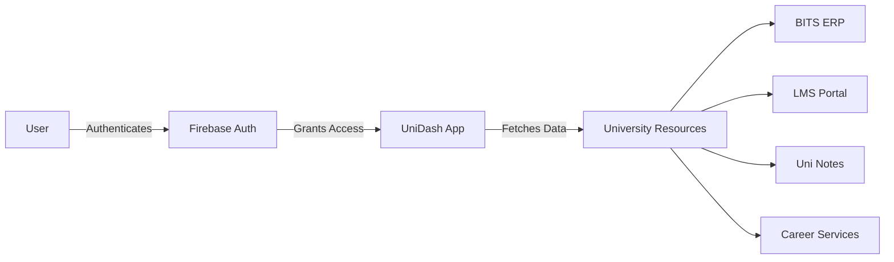
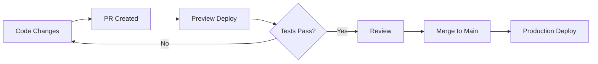

# UniDash 🎓

> A unified portal aggregator for BITS Pilani Dubai Campus

UniDash simplifies university life by bringing all your academic tools and resources into one place. Built specifically for BITS Pilani Dubai Campus students and faculty.

[](https://nextjs.org/)
[](https://www.typescriptlang.org/)
[](https://tailwindcss.com/)

## 📚 Table of Contents

- [Features](#-features)
- [Tech Stack](#-tech-stack)
- [Architecture](#-architecture)
- [Getting Started](#-getting-started)
- [Development](#-development)
- [Contributing](#-contributing)
- [Deployment](#-deployment)

## 🚀 Features

- **Unified Access**: Single sign-on for ERP, LMS, and other university portals
- **Career Services**: 
  - Company listings for PS1/PS2
  - Resume building tools
  - Career guidance scheduling
- **Academic Tools**:
  - Course pathways guide
  - Previous year papers analysis
  - Student-contributed notes
- **Resource Hub**: 
  - ACM library access
  - Google DSC resources
  - MTC materials

## 💻 Tech Stack

- **Frontend Framework**: Next.js 14
- **Language**: TypeScript
- **Styling**: Tailwind CSS
- **UI Components**: Radix UI, Shadcn UI
- **Authentication**: Firebase Authentication
- **State Management**: React Hooks
- **Data Fetching**: SWR
- **PWA Support**: next-pwa
- **CSV Parsing**: Papa Parse
- **Icons**: Lucide React

## 📈 Architecture





## Project Structure

The project follows a typical Next.js structure with some custom organization:

## Getting Started

First, run the development server:

```bash
npm run dev
# or
yarn dev
# or
pnpm dev
# or
bun dev
```

# Project Documentation

Open [http://localhost:3000](http://localhost:3000) with your browser to see the result.

You can start editing the page by modifying `app/page.tsx`. The page auto-updates as you edit the file.

This project uses [`next/font`](https://nextjs.org/docs/basic-features/font-optimization) to automatically optimize and load Inter, a custom Google Font.

### Contribution Guidelines

1. **Fork & Clone**
   ```mermaid
   flowchart LR
       A[Fork] --> B[Clone]
       B --> C[Setup]
       C --> D[Branch]
   ```

2. **Development Workflow**
   ```mermaid
   flowchart LR
       A[Code] --> B[Test]
       B --> C[Commit]
       C --> D[Push]
   ```

3. **Pull Request Process**
   ```mermaid
   flowchart LR
       A[Create PR] --> B[Review]
       B --> C[Address Comments]
       C --> D[Merge]
   ```

## 📦 Deployment


