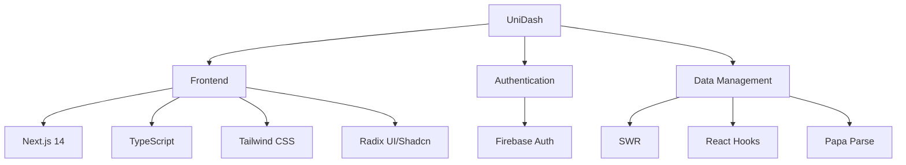
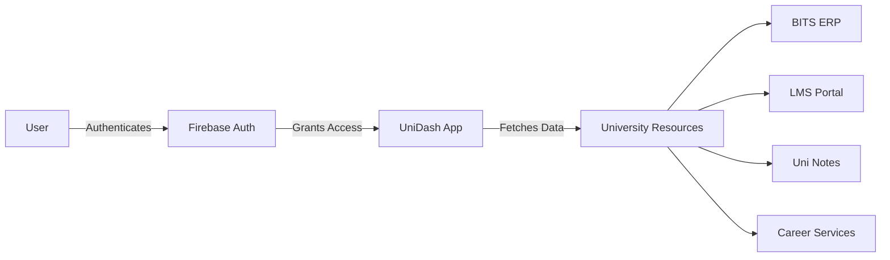
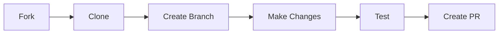
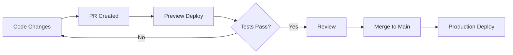

# UniDash 🎓

> A unified portal aggregator for BITS Pilani Dubai Campus

UniDash simplifies university life by bringing all your academic tools and resources into one place. Built specifically for BITS Pilani Dubai Campus students and faculty.

[](https://nextjs.org/)
[](https://www.typescriptlang.org/)
[](https://tailwindcss.com/)

## 📚 Quick Start

```bash
# Clone the repository
git clone https://github.com/yourusername/unidash.git

# Install dependencies
npm install

# Start development server
npm run dev
```

Open [http://localhost:3000](http://localhost:3000) to view the app.

## 🚀 Key Features

### 📱 Core Functionality
- Single sign-on integration for all university portals
- Unified dashboard for ERP, LMS, and other systems
- Progressive Web App (PWA) support

### 📚 Academic Resources
- Course pathways visualization
- Previous year papers repository
- Student-contributed study materials
- ACM library access integration

### 💼 Career Services
- PS1/PS2 company listings
- Resume builder and templates
- Career counseling appointment system
- Google DSC resources

## 🛠️ Technical Overview

### Tech Stack
- **Framework**: Next.js 14
- **Language**: TypeScript
- **Styling**: Tailwind CSS + Radix UI/Shadcn
- **Authentication**: Firebase
- **Data Management**: 
  - SWR for fetching
  - React Hooks for state
  - Papa Parse for CSV handling
- **Icons**: Lucide React

### System Architecture



### User Flow



## 👩‍💻 Development Guide

### Project Structure
```
unidash/
├── src/
│   ├── app/         # Next.js app router
│   ├── components/  # Reusable UI components
│   ├── lib/        # Utility functions
│   └── styles/     # Global styles
├── public/         # Static assets
└── tests/         # Test files
```

### Contributing Workflow



## 🚀 Deployment

### Deployment Flow


## 📄 Additional Resources

- [Contributing Guidelines](CONTRIBUTING.md)
- [Code of Conduct](CODE_OF_CONDUCT.md)
- [License](LICENSE.md)

## 🤝 Support

For support, email support@unidash.com or join our [Discord community](https://discord.gg/unidash).